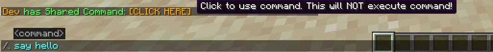

# Overview
A simple mod that allows you to send a command to friends.   
Command can be run as a player or server.  
Mod is not required on client to work.  
# Commands
You can either run `/relay <command>` or `/. <command>`
## Example
- `/relay say hello`
- `/. say hello`

## Output
